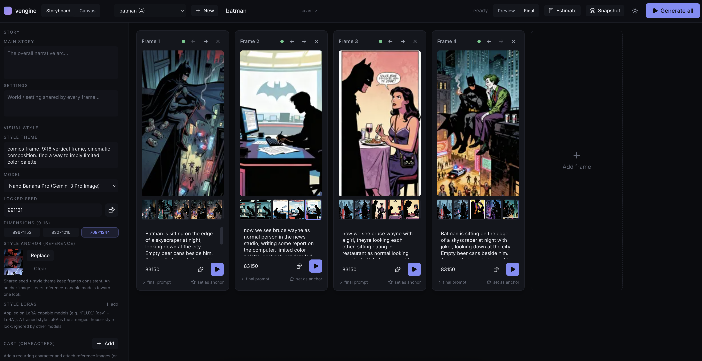

# vengine

A node-based **visual engine** for generating consistent, production-grade image artwork
through remote model APIs (fal.ai, Replicate, Higgsfield) plus a local compositing pipeline.

Think **ComfyUI, but API-only and cost-aware** — a personal, local-first tool for a solo
creator. No GPUs to run, no servers to manage. You wire up models and post-processing on a
visual canvas, and the engine only ever re-runs (and re-bills) the parts that actually changed.



## What it does

- **Node graph canvas** — connect generation, compositing, and I/O nodes visually (React Flow).
- **One integration, many models** — fal.ai unlocks Nano Banana Pro, Seedream, Qwen, Z-Image,
  and Flux.2 behind a single adapter. New vendors = one adapter, no core changes.
- **Cost control as a first-class feature** — content-addressed caching, a dry-run planner
  that shows "this run will cost ~$X" before you spend, preview-vs-final quality modes, and a
  cancel button that stops paid spend mid-run.
- **Consistency** — locked seeds, reference/anchor images, and deterministic re-runs so a
  character or style stays the same across many generations.
- **Comic Studio** — a storyboard layer for the primary use case: ~4-frame, 9:16 vertical
  art comics. Iterate per frame, roll variants, pick the best, pay only for what you regenerate.

## Quick start

Requires **Node ≥ 22** and **pnpm**.

```bash
pnpm install

# add your fal.ai key — the only one needed to start
cp .env.example .env   # then fill in FAL_KEY

pnpm dev               # server on :5174, web client on :5173
```

Open http://localhost:5173. Without any keys it still runs end-to-end against a built-in
mock provider (offline), so you can explore the graph and compositing flow for free.

### Keys

API keys live **only on the server** and are never sent to the browser. `FAL_KEY` is the
only one required. Optional: `REPLICATE_KEY`, `HIGGSFIELD_KEY`, `ANTHROPIC_API_KEY`
(Claude prompt assistance). See `.env.example`.

## How it's built

A pnpm + Turborepo monorepo, TypeScript end to end:

```
apps/
  web/        React + Vite canvas, inspector, gallery, Comic Studio
  server/     Hono HTTP + WebSocket: run/plan/models/assets, live progress
  cli/        command-line entry
packages/
  core/       node model, execution engine, content-addressed cache, planner
  nodes/      node definitions (generation / compositing / io / logic)
  providers/  ModelAdapter contract + fal / mock adapters
  storage/    content-addressed asset store, project store, output cache
  shared/     zod schemas and types shared across client + server
docs/
  ENGINEERING.md   full design document
```

The execution engine parses the graph into a DAG, topologically sorts it, and computes a
content-addressed cache key per node (`type · version · params · upstream output hashes`).
Cache hit → skip and reuse; cache miss → run. Generation nodes go through the provider
layer (async queues/webhooks normalized to one promise); compositing runs locally via sharp.

## Common scripts

```bash
pnpm dev         # run server + web
pnpm build       # build all packages
pnpm test        # vitest
pnpm typecheck   # type-check the workspace
pnpm lint
```

## Status

Early but functional. Foundations and a vertical slice (generate → resize → export) work in
the browser, and Comic Studio is implemented. See `docs/ENGINEERING.md` for the architecture,
roadmap, and design rationale.

> **Note:** local-first and single-user by design. The server holds your API keys and bills
> real money per generation — keep it on `127.0.0.1`. If you ever expose it publicly, add auth,
> HTTPS, and a hard spend cap first (see the deployment section in the engineering doc).
