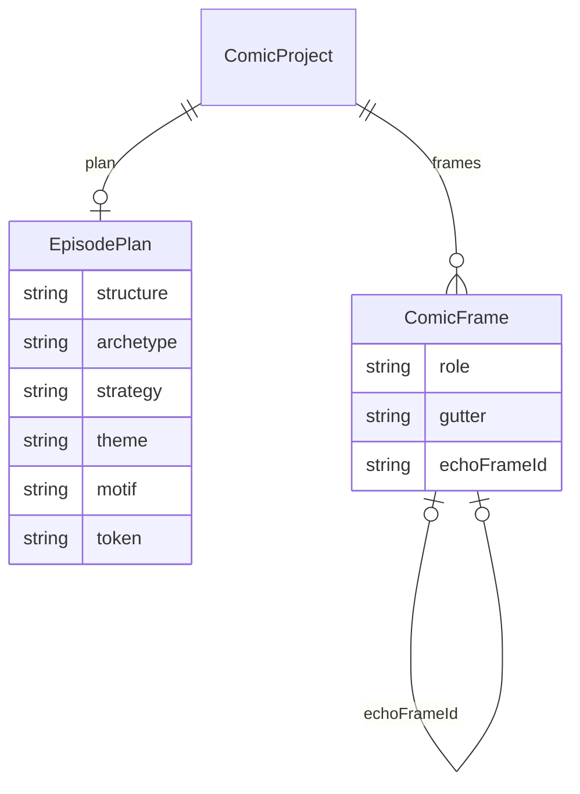

# Episode Studio — Design Spec

**Status:** Phase 1 implemented (2026-09-25 — see [`ENGINEERING.md` §20](ENGINEERING.md)) · Phases 2–5 spec-only · **Date:** 2026-09-25 · **Applies to:** the 4-vertical-frame Comic Studio

Diagrams: [`diagrams/episode-studio-lifecycle.mmd`](diagrams/episode-studio-lifecycle.mmd) · [`diagrams/episode-studio-datamodel.mmd`](diagrams/episode-studio-datamodel.mmd)

---

## 0. Summary

Today an episode is a flat list of four frame prompts, each composed in isolation: the same craft directive for every frame of every episode, camera chosen in a vacuum, no concept of what a panel *is* in the story, no transitions, and continuity references resolved before the source image exists. Episodes come out technically consistent (locked seed, identity refs, palette locks) but creatively flat — four nice images rather than a *directed strip*.

This spec makes the episode a **planned artifact**. One new object — the **EpisodePlan** — records what kind of episode this is (structure, art direction, theme, motif). Frames gain **roles** (establish / develop / turn / settle…), **typed gutters** (how this panel connects to the previous one, McCloud's six transitions), and an optional **echo** (final panel mirrors the first — the payout device). Prompt composition becomes role- and gutter-aware. Draft parsing emits the plan alongside the beats. Runs execute in **dependency waves** so a continuation always sees its source's finished image. Later phases add a closed-loop editorial pass (VQQA-style visual QA with global selection), series-level canon progressions, and per-universe style profiles.

Grounding: Google Research's 2026 long-form-coherence work (Co-Director, CANVAS, A²RD, VQQA), comics craft codified (McCloud transitions, kishōtenketsu, Peanuts corpus data, storyboarding shot grammar), and a 2026 consistency/product scan (reference-first vs LoRA, model routing, entity-centric series bibles). Condensed references in §12.

```mermaid
flowchart LR
  draft["Paste draft"] --> parse["Draft parse v2 — plan + beats with role / gutter / camera"]
  parse --> apply["Apply — project gains EpisodePlan, frames gain structure fields"]
  apply --> notes["Review notes — rhythm warnings + gutter budget flags"]
  notes --> waves["Wave runner — topological order over continues/echo links"]
  subgraph perframe["Per frame"]
    compose["composeFramePrompt v2 — art direction + role craft + transition + echo"] --> gen["generate.text-to-image"]
  end
  waves --> compose
  gen --> loop["Editorial loop — VQQA gradients, best-of-3, Global Selection"]
  loop --> judge["Strip judge — factored rubric, verdict feeds memory"]
  judge --> pub["Publish — canon ledger append"]
  pub --> next["Next episode greenlight — archive + series memory"]
```



*Phases: flow through `waves` and `compose` is Phase 1 (implemented). `loop`/`judge` is Phase 2, `pub`/`next` Phase 3–5 (sketches in §8–§9).*

## 1. Goals & non-goals

**Goals**

- **Artistic & unique** — every episode carries its own art direction (archetype, theme, motif) instead of one house masterwork sentence for all frames everywhere.
- **Cinematic** — shot progression is a designed sequence; the twist panel takes the episode's biggest camera change; consecutive same-shot panels are flagged.
- **Narrative** — frame roles and typed gutters make the strip's structure explicit, reviewable, editable — by the author and the director chat.
- **Entertaining** — structure templates from proven 4-panel forms (kishōtenketsu; the Peanuts escalate-detonate gag) land the turn and the payoff where readers expect them.
- **Consistent** — continuity runs respect causality (waves); the echo device reuses composition deliberately; identity/palette machinery is unchanged.
- **Genuine** — the plan's theme/motif thread through every frame prompt, so episodes feel authored around one idea.
- **Refinable** — every creative decision is data (schema fields) or versioned prompt text, never vibes baked into code paths; an eval harness can regress it (§10).

**Non-goals (for now)**

- Page/panel-grid layout — frames stay four independent 9:16 verticals; borders stay negatively prompted.
- Lettering/balloons in-image — `script` stays metadata. A post-lettering pass is a future phase.
- World simulation, auto-trained LoRAs, auto-published canon — explicitly out; humans stay the publisher.
- Frame-count reasoning — the author's beat count (or the 4-frame default) stands. The plan *describes* the structure; it doesn't resize the episode. (5th+ frames get roles from a documented extension map when they arrive.)

**Invariants (must hold throughout)**

1. **No migration.** Every new schema field is optional or fully defaulted; any pre-existing project JSON parses and runs identically.
2. **Preview == compile == run.** The UI "final prompt" preview calls the same pure `composeFramePrompt` the compiler bakes. No prompt text is constructed anywhere else.
3. **LLM proposes, typed appliers apply.** All model output passes through zod + pure deterministic appliers (the existing draft/director discipline).
4. **Nothing silently breaks on edit.** Reorder/delete never invalidates a run: links resolve defensively exactly as `continuityReferences` does today.

## 2. Current state (what this builds on)

Verified against the tree at spec time:

| Piece | Where | Behaviour today |
|---|---|---|
| Draft parse | `apps/server/src/draft.ts` → `packages/shared/src/draft.ts` | LLM → `{title, story, storyMood, settings, frames[{prompt, script, characters, thread, mood, palette, continues}]}`; keeps the author's beat count; "mentions stay invisible" rule |
| Apply | `apps/web/src/comicStore.ts` (`draftToFrames`, `importStory`, `applyDraft`) | reviewable client-side apply; `continues` accepted only when strictly earlier |
| Prompt composition | `packages/shared/src/comic.ts` `composeFramePrompt` | template → `CRAFT_DIRECTIVE` (one constant, every frame) → camera → mood → palette → exactly one continuity/reference directive |
| Camera | `CAMERA_PRESETS` (14), `cameraDirective` | per-frame free phrase; no cross-frame awareness |
| Continuity | `continuesFrameId` + `continuesMode` (`shot`/`restage`), `continuityDirective`, `continuityReferences` | pairwise link to an earlier frame's *current image*, resolved at compile time |
| Compile & run | `compileComic` → `apps/server/src/comics.ts` `/run` → executor | frames are DAG siblings; references resolve at compile time, so a first "generate all" can feed a continuation a missing/stale prior |
| Director | `packages/shared/src/director.ts` + `apps/server/src/director.ts` | typed change-set chat; can rewrite frames/cast/eras but has no notion of plan/roles/gutters |
| Universe | `library.ts` (characters, eras, StylePack), `scene.ts` (`Series`), `seed-batman.ts` | series premise, cast aliases, style anchors/palette, era pinning |

The creative gaps this spec closes: no episode-level art direction; no frame roles; no transitions; no shot-rhythm reasoning; no dependency-ordered generation; no closed quality loop; no canon state between episodes.

## 3. Concepts

### 3.1 EpisodePlan — the episode's creative configuration

One small object on the project, sampled from the series premise (by the draft model now; by a greenlight/archive pass in Phase 5). It is the "one unified vision" that every frame prompt receives.

| Field | Meaning | Example (BTAS episode) |
|---|---|---|
| `structure` | which proven 4-beat form | `kishotenketsu` |
| `archetype` | this episode's art direction phrase | "rain-soaked neon night, mirrors everywhere, 70% dark values" |
| `strategy` | the experiment / creative angle | "villain POV — Batman never fully seen" |
| `theme` | the thematic through-line from the series premise | "vanity" |
| `motif` | the recurring central image (must appear/recall ≥2 times before its payoff) | "the cracked mirror" |
| `token` | the serialization element passed forward to the next episode | "Joker keeps the torn photograph" |

Structures and their role maps (the vocabulary of roles is closed; maps are data):

| `structure` | P1 | P2 | P3 | P4 | Notes |
|---|---|---|---|---|---|
| `kishotenketsu` | establish | develop | turn | settle | Twist lands P3, quick landing P4 (yonkoma orthodoxy) |
| `detonate` | establish | develop | escalate | payoff | Peanuts shape: escalate P1–P3, punchline P4 (96% of corpus) |
| `continuous` | establish | develop | turn | settle | One continuous moment, four angles — gutters do the work (all `moment`) |
| `framed-tale` | establish | develop | turn | settle | Nested/interleaved storylines — `thread` + `continues` to non-adjacent frames do the work |

### 3.2 Frame role — what this panel *is*

`frame.role: FrameRole` — `establish | develop | escalate | turn | settle | payoff` — defaults from the plan's slot map. Roles parameterize the craft directive (§5.2) and drive review warnings (P3 should be the camera-change maximum; P4 re-stabilizes). Roles are labels with teeth: composition, not just metadata.

### 3.3 Typed gutters — the transition *into* this panel

`frame.gutter: GutterType` — `moment | action | subject | scene | aspect | nonsequitur` (McCloud's six), set on frame *i* ≥ 1 to describe the gutter between *i−1* and *i*. Each type carries generation consequences — this is what makes it machinery rather than taxonomy:

| Gutter | Time | Continuity link | Cast refs | Palette | Camera |
|---|---|---|---|---|---|
| `moment` | a heartbeat | continues previous, `shot`-like tight hold | keep | inherit | same logic, one instant changed |
| `action` | meaningfully later | continues previous (`restage`) | keep | inherit | **must change** distance or angle |
| `subject` | same beat | continues previous (`restage`) | emphasis shifts to who matters now | inherit | new focal subject |
| `scene` | jump | **no** continuity ref | fresh anchors | new space reads clean | establish the new place |
| `aspect` | suspended | **no** continuity ref, `characterIds: []` | none | thread palette carries mood | no subject — place/texture/light |
| `nonsequitur` | none | **no** continuity ref | as prompted | deliberate rupture | commit fully |

Budget rules (surfaced as review notes, never blocking): mostly `action`; ≤1 `scene` per episode; `aspect` only in P1–P2 (positions, not hard rule, of a 4-strip); `nonsequitur` only when the plan says the joke is the leap. Reader-effort score `moment 1 · action 2 · subject 3 · aspect 4 · scene 5 · nonsequitur 6`; flag strips summing > 12.

**Reconciliation rule (the important one):** when applying a parse, `moment|action|subject` with no explicit `continues` auto-links to frame *i−1*; `scene|aspect|nonsequitur` clears an auto-link but never clears an explicit non-adjacent link (the framed-tale return: P4 `action`-continuing P1). This keeps `gutter` and `continuesFrameId` from ever contradicting each other.

### 3.4 Shot rhythm — camera as a designed sequence

No new frame field. `CameraPreset` gains a coarse `size` class (`xws | wide | full | medium | close | xcu`); a pure `rhythmWarnings(project)` compares adjacent frames' sizes (free-text cameras simply don't participate). Warnings: adjacent identical sizes (unless gutter is `moment`); P3 not the largest size-jump in the episode (advisory). The draft prompt asks for a deliberate progression (e.g. wide → medium → close → wide bookend); the validator keeps the model honest.

### 3.5 Echo — the bookend payout

`frame.echoFrameId?: string` (strictly earlier, validated like `continuesFrameId`). The echo source's image is fed as the **leading reference** and the prompt carries the echo directive: mirror the composition with exactly the described change. This is the Watchmen move — P4 mirrors P1 with one thing different — and it reuses the existing edit-endpoint composition-matching path (`referenceMode: "match"` semantics), just pointed at a frame image. An echo overrides the plain reference directive; it does not conflict with a continuity link (a frame has at most one of `continuesFrameId` / `echoFrameId` governing composition — echo wins if both are somehow set, and a review note fires).

## 4. Data model

All in `packages/shared/src/comic.ts` unless noted. Everything optional/defaulted — **zero migration**.

```ts
/** Which proven 4-beat form this episode follows. */
export const EPISODE_STRUCTURES = ["kishotenketsu", "detonate", "continuous", "framed-tale"] as const;
export type EpisodeStructure = (typeof EPISODE_STRUCTURES)[number];

/** The role a panel plays in the structure (vocabulary is closed; slot maps are data). */
export const FRAME_ROLES = ["establish", "develop", "escalate", "turn", "settle", "payoff"] as const;
export type FrameRole = (typeof FRAME_ROLES)[number];

/** Structure → the four slot roles (frames beyond 4 repeat `develop`/`escalate`). */
export const STRUCTURE_ROLES: Record<EpisodeStructure, FrameRole[]> = {
  kishotenketsu: ["establish", "develop", "turn", "settle"],
  detonate:      ["establish", "develop", "escalate", "payoff"],
  continuous:    ["establish", "develop", "turn", "settle"],
  "framed-tale": ["establish", "develop", "turn", "settle"],
};

/** How this panel connects to the previous one (McCloud's six transitions). */
export const GUTTER_TYPES = ["moment", "action", "subject", "scene", "aspect", "nonsequitur"] as const;
export type GutterType = (typeof GUTTER_TYPES)[number];

export const EpisodePlanSchema = z.object({
  structure: z.enum(EPISODE_STRUCTURES).default("kishotenketsu"),
  archetype: z.string().default(""),  // this episode's art direction
  strategy:  z.string().default(""),  // the creative experiment
  theme:     z.string().default(""),  // through-line from the series premise
  motif:     z.string().default(""),  // recurring central image
  token:     z.string().default(""),  // element passed to the next episode
});
export type EpisodePlan = z.infer<typeof EpisodePlanSchema>;
```

Additions to existing schemas:

```ts
// ComicProjectSchema
plan: EpisodePlanSchema.optional(),

// ComicFrameSchema
/** This panel's role in the episode structure (defaults from STRUCTURE_ROLES). */
role: z.enum(FRAME_ROLES).optional(),
/** The gutter between the previous panel and this one (frame i ≥ 1 only). */
gutter: z.enum(GUTTER_TYPES).optional(),
/** Strictly-earlier frame whose composition this panel mirrors (the bookend payout). */
echoFrameId: z.string().optional(),
```

`CameraPreset` gains `size: "xws" | "wide" | "full" | "medium" | "close" | "xcu"` (typed as `ShotSize`); `cameraSizeOf(frame)` maps a frame's `camera` back to a preset's size or `undefined`.

Draft contract (`packages/shared/src/draft.ts`): `DraftParseSchema` gains `plan: EpisodePlanSchema.optional()`; `DraftFrameSchema` gains `role: z.enum(FRAME_ROLES).optional()` and `gutter: z.enum(GUTTER_TYPES).optional()`. Server-side sanitization drops a `gutter`/`echo` on a *first* frame (`gutter` is meaningless without a predecessor) exactly like `sanitizeContinues` drops junk today — a first-frame `role` is kept on purpose (the slot map's P1 slot IS `establish`; deviation noted in the Appendix).



## 5. Prompt composition v2 — `composeFramePrompt`

Same function, same single source of truth (UI preview, compiler, run). New block order:

1. **Template substitution** — unchanged (`{frame}` leads; `{story}` stays opt-in).
2. **Art direction block** *(new)* — when the plan carries anything:
   `Art direction: {archetype}. Theme: {theme}. Motif: weave "{motif}" into this frame only where it earns its place.`
   Lines whose value is empty are dropped (existing dangling-label discipline).
3. **Craft directive** — now `craftDirective(role?)`: the existing `CRAFT_DIRECTIVE` sentence, extended by a role-flavor sentence when `role` is set (see below). Hand-written prompts keep the house baseline exactly as today when no role is set.
4. **Camera** — unchanged (`Camera:`).
5. **Mood** — unchanged (`Mood:`).
6. **Palette** — unchanged (thread > project override semantics).
7. **Transition directive** *(new)* — frames *i ≥ 1* with a `gutter` emit `Transition: …` (§5.3). Sits before the reference directives so the gutter's intent frames how the references are used.
8. **Exactly one composition-governing directive** — unchanged precedence, one addition: a resolved **echo** takes over composition (echo directive + the echo image leads `frameReferences`); then continuity as today; then plain reference directive.

### 5.1 Role flavors (data, not code paths)

```
establish — "This is the establishing panel: read the world — geography and emotional
  temperature; let the frame breathe; hold the subject back or show it small."
develop   — "This panel must add NEW information — a second read of the space or a real
  step forward; never restate the previous panel."
escalate  — "Raise the pressure: tighter framing, more kinetic staging, more of the
  frame filled; the reader should feel the incline."
turn      — "This is the fulcrum: take the episode's biggest camera change and make the
  status-quo shift visible at a glance."
settle    — "This is the landing: return to a stable, simple composition; one clear
  image the reader leaves with."
payoff    — "This is the detonation: the panel that retroactively makes the previous
  panels cohere — dominant, high-contrast, readable at a glance."
```

### 5.2 Transition directives (per gutter, on the entering frame)

```
moment      — "Transition from the previous panel: a heartbeat later — same subject and
              framing logic, one instant of change."
action      — "Transition: meaningfully later in the same action — same scene and
              participants, advanced in time; take a NEW camera distance or angle."
subject     — "Transition: within the same scene and beat, the camera cuts to who or
              what matters now."
scene       — "Transition: a new scene — deliberate jump in place or time; establish
              the new space cleanly, with no visual bridge to the previous palette."
aspect      — "Transition: an aspect of the same place and mood — no subject, no
              action; texture, weather, light, objects at rest."
nonsequitur — "Transition: a hard cut with no literal continuity — the juxtaposition
              itself is the meaning; commit fully to the new image."
```

### 5.3 Echo directive

```
Echo: the FIRST attached image is this episode's opening composition — mirror its
framing, camera and figure placement, changing exactly what the description above
specifies; the mirrored composition IS the payoff. Remaining attached images are the
character and style reference sheets: take each character's identity from their own
sheet, never from how they appear in the mirrored image.
```

`frameReferences` order becomes: continuity ref → **echo ref** (when set & resolved; echo leads if both, per §3.5) → frame's own refs → cast identity refs → style refs. Dedup/caps exactly as today.

## 6. Draft parse v2

`apps/server/src/draft.ts` system prompt gains, in spirit:

- **Plan first, beats second.** Before splitting beats, decide the `plan` (structure / archetype / strategy / theme / motif / token), respecting the detected universe's premise and the "no invented art style/medium" rule — archetype is *direction* (light, palette, camera attitude), never a new medium.
- **Role every beat** with the structure's slot map; role and gutter must agree with the story's actual shape.
- **Type every gutter** (beats 2+). Defaults to `action`; use `aspect` only in the first half; at most one `scene`.
- **Design the camera progression** — name a shot-size sequence (e.g. wide → medium → close → wide) and set each frame's `camera` from `CAMERA_PRESETS`-style language; the twist panel takes the largest jump.
- **P2 must add new information** (the top amateur mistake is restating P1).
- **Offer an echo** when the story's ending genuinely mirrors its opening; set `echo` (strictly-earlier index).
- All existing rules stand verbatim: author's beat count, visible-only, thread contrast, strictly-earlier `continues`, no invented style.

Apply-side (`draftToFrames` in `apps/web/src/comicStore.ts`, mirrored in `apps/server/scripts/ingest-story.ts`): map `plan` → `project.plan`; `role`/`gutter`/`echo` → frames (echo index validated strictly-earlier like `continues`); then run the **gutter reconciliation** (§3.3); then compute review notes and show them in `DraftModal` (plan card + chips + warnings), applying regardless — notes advise, the author decides.

## 7. Staged continuity runs (the wave runner)

Problem: `generate.text-to-image` takes no input ports (references are compile-time param hashes), and frames are DAG siblings — so "generate all" on a fresh episode compiles continuations before their sources exist.

Fix at the orchestration layer (no engine changes): the server `/api/comics/:id/run` handler runs **waves**.

```
function runWaves(project, frameIds?):
  pending = selected frames
  loop:
    ready = pending frames whose continuesFrameId is unset, or points outside
            `pending`, or at a frame that already has an image (frameImageHash)
    if ready is empty: run the remainder in one final wave
            (continuityReferences already drops unresolved links — a run never breaks)
    run(ready)            // existing runHost path; compile resolves refs against
                          // freshly persisted resultHashes from the previous wave
    persist variants/resultHashes; remove ready from pending
  until pending is empty
```

Unchanged frames are content-addressed cache hits, so re-compiling per wave costs nothing. Example: frames 1&4 one thread (4 continues 1), 2&3 independent → wave 1 = [1,2,3], wave 2 = [4]. Cycles (impossible via strictly-earlier validation, but defensive) fall through to the final wave. WS progress/cancel semantics unchanged; the `*` bracket event may simply fire per wave.

## 8. Phase 2 — editorial loop & strip judge (spec summary)

Closed-loop quality on top of the variant strip, reusing the existing vision adapter (the `SceneBreakdown` path):

- **Frame review (`POST /api/comics/:id/frames/:frameId/review`):** a text pass derives yes/no **visual questions** from the frame's own spec (subjects present, props in hand, wardrobe, camera attitude, palette adherence, gutter honored); a vision model answers; each failure yields a **semantic gradient** — one natural-language prompt edit, one issue per pass (VQQA + A²RD's single-edit rule). The refined prompt generates a new variant; **Global Selection** scores *every* variant against the *original* spec and recommends the argmax (early-stop when a variant passes clean). Author confirms the pick — the loop recommends, never overrides.
- **Strip judge:** after all four panels exist, one multimodal pass scores the factored rubric — `structure` (did the roles land?), `direction` (archetype/style fidelity), `craft`, `continuity` — plus notes. Stored on the project (`review` field); disagreement between two judge passes flags "route to human". Feeds the Phase 5 archive.
- Schema home: new `packages/shared/src/review.ts` (`FrameAuditSchema`, `EpisodeReviewSchema`), same contract discipline as draft/director.

## 9. Phases 3–5 — series layer (sketches)

- **Phase 3 — canon & progressions.** `Series` gains `progressions` (facts keyed "as of episode N": injuries, relationships, wardrobe state — the era mechanism generalized) and a `ledger` of published events appended **only** by an explicit publish action (new endpoint), never by generation. Plan facts gain a `revealed` flag: reader-knowledge vs canon-truth — the promoted, structural version of "mentions stay invisible".
- **Phase 4 — style profiles & multi-model routing.** `StylePack` grows `cameraVocabulary`/`bannedDevices` (a watercolor universe bans dutch tilts), optional per-style model binding (manga universes route to SD-lineage models, painterly to Nano Banana Pro — the fal registry already abstracts this), and a deterministic palette post-pass (LUT/quantize) as a new cheap node after generation — the only model-independent palette guarantee across 20+ episodes.
- **Phase 5 — greenlight.** Per-series quality-diversity archive (MAP-Elites over structure × archetype × theme): each niche keeps its best-judged episode's plan config; the next episode's plan is sampled with structural exploration (empty niches attractive), which is the systematic cure for "every episode feels the same". A MAPO-style prompt-case memory compounds refinement lessons across episodes.

## 10. Evaluation & fine-tuning

- **Golden episodes:** 3–5 hand-approved episodes per universe; any change to directive text (`ROLE_FLAVORS`, transitions, craft) or composition order re-scores them via the strip judge; regressions block merge of prompt-text PRs.
- **Judge calibration:** a small human-rated set tracks judge↔human agreement per rubric axis; pairwise comparisons with position-swapping; two heterogeneous judge models, majority/median aggregation (PoLL pattern), disagreement → human queue.
- **Diversity metric:** archive coverage/entropy per series detects mode collapse directly ("three episodes in a row sampled one niche" is an alert).
- **Economics:** cost per *accepted* panel (generation + review + judging) is the tracked number; early-stop thresholds bound it.

## 11. Director integration

New/extended ops in `packages/shared/src/director.ts` (server prompt told about them):

| Op | Fields | Effect |
|---|---|---|
| `updatePlan` | `structure?, archetype?, strategy?, theme?, motif?, token?` (nullable = clear) | edits `project.plan`; a `structure` change remaps frame roles to the new slot map and logs it |
| `updateFrame` *(extended)* | `role?`, `gutter?` (clearable), `echoFrameIndex?` (nullable, strictly-earlier validated like `continuesFrameIndex`) | per-frame structure edits |
| *(existing ops unchanged)* | | plan-aware system prompt: the director sees the plan and critiques against it ("P3 isn't reading as the turn — camera too close to P2") |

## 12. Craft codex & research references

The encodable rules the prompts and validators draw from (sources: McCloud *Understanding Comics*; Cohn 2011 transition-frequency counts; yonkoma/kishōtenketsu practice; the 17,897-strip Peanuts corpus; storyboarding shot grammar; webtoon scroll pacing; Watchmen #5 "Fearful Symmetry"): P2 must add new info · P3 is the fulcrum and the camera-change maximum · P4 re-stabilizes or detonates · every panel changes something (scale/angle/subject/time) · aspect-to-aspect only early · one scene-jump max · the gap before the final reveal is the page turn · motifs recur before they pay off · bookend = P4 mirrors P1 with one change · palette contrast peaks on the turn.

Systems research this design adapts: Co-Director (arXiv:2604.24842 — creative config injected into every stage; factored judging), CANVAS (2604.13452 — world-state plan + anchor memory; best-of-3 saturates), A²RD (2605.06924 — extrapolate/interpolate scheduling; single-issue refinement; prompt-case memory), VQQA (2603.12310 — visual questions as semantic gradients; Global Selection), MangaFlow (2605.28173 — plan/layout/render as editable artifacts), Dramatron (2209.14958 — edit-any-level UX), MAP-Elites/QDAIF (1504.04909 / 2310.13032 — diverse archives), PoLL (2404.18796 — judge juries).

## 13. Implementation phases & acceptance criteria

### Phase 1 — the planned episode (implemented 2026-09-25)

1. Shared schemas & constants: `EpisodePlanSchema`, structure/role/gutter types, `STRUCTURE_ROLES`, `CameraPreset.size`, `cameraSizeOf`, `rhythmWarnings`, `gutterReconcile` (pure; `packages/shared/src/comic.ts`).
2. `composeFramePrompt` v2 with art-direction block, `craftDirective(role)`, `transitionDirective(gutter)`, `echoDirective` + `echoReferences` woven into `frameReferences`/directive precedence (§5).
3. Draft parse v2: server prompt + `DraftParseSchema`/`DraftFrameSchema` additions + sanitize first-frame gutters.
4. Apply: `draftToFrames`/`importStory` map plan/role/gutter/echo + reconciliation; `ingest-story.ts` parity.
5. Wave runner in `apps/server/src/comics.ts` `/run`.
6. Director: `updatePlan` op + extended `updateFrame` + prompt updates.
7. UI: DraftModal plan card + per-frame role/gutter chips + review notes; FrameCard role/gutter selects + echo picker; a thin rhythm rail (shot sizes + warning icon) above the frame strip.
8. Tests mirroring `comic.test.ts`/`draft.test.ts`/`director.test.ts` style; `docs/ENGINEERING.md` gains a §20 pointer.

**Acceptance (all verifiable by tests/preview):**

- A pre-existing project JSON (no plan/role/gutter/echo) parses and composes **byte-identical** prompts to the previous release (golden test on `composeFramePrompt`).
- Preview text == compiled node prompt for every new feature (the preview path already calls the same function — add a regression test).
- Gutter reconciliation: `action` w/o `continues` links to *i−1*; `scene` clears auto-links; explicit non-adjacent links survive (`framed-tale` P4→P1).
- Waves: [1,2,3] then [4] for the interleaved case; unresolved links never error; unchanged frames are cache hits (run twice, second run free).
- `rhythmWarnings` fires on adjacent identical preset sizes except `moment` gutters; advisory only.
- Echo: resolved echo leads references; both echo+continuity set → echo governs + review note.
- Director `updatePlan.structure` remaps roles; invalid indices skipped & surfaced, as everywhere.
- `pnpm --filter @vengine/shared test && pnpm --filter @vengine/shared typecheck` (and server/web) green.

### Phase 2 — editorial loop & judge · ### Phase 3 — canon/progressions · ### Phase 4 — style profiles & routing · ### Phase 5 — greenlight archive

Sequenced after Phase 1 lands and is used on real episodes; specs §8–§9 graduate to full sections when their phase starts.

## 14. Risks & mitigations

| Risk | Mitigation |
|---|---|
| Plan fields become decorative metadata models ignore | Every field is composed into prompts (§5) or validated (§3.3–3.5) — a field that does no work doesn't ship |
| Directive stacking bloats prompts | One directive per concern, drop-empty discipline, golden prompt-length test |
| Draft model mis-assigns gutters/roles | Reconciliation rules + review notes; author sees chips before generating |
| Waves slow "generate all" (sequential feels slower) | Only linked chains serialize; independent frames stay concurrent; cache makes re-runs free |
| Judge homogenizes taste (Phase 2+) | Pairwise + jury + diversity metric; author confirms every recommendation |

## 15. Open questions

- Should `detonate`'s P3 flavor differ from `turn`'s when both exist in a 5+ frame future? (Defer until frame count > 4.)
- Thread-level gutters (transition between storylines vs within one) — does `framed-tale` need a second, thread-scoped gutter field? (Watch real usage first.)
- Should the draft parse emit a structured per-beat camera (a `CAMERA_PRESETS` value, not prose)? Today the system prompt asks for shot language *inside* `prompt` text, so `rhythmWarnings`' shot-size checks can only fire once beats land on frames with cameras — the DraftModal's pre-apply review sees only gutter-budget and link-contradiction notes. (Extract a structured `camera` when real usage shows mis-set progressions.)
- Should the echo be promotable to a library composition study (the Character System already has composition studies)?
- Phase 5 archive storage: D1 per series vs in-library JSON. (Decide at Phase 5.)

---

## Appendix — session kickoffs

Phase 1 was built from a kickoff scoped exactly to §13 (session of 2026-09-25). What shipped — including the
deviations (leaf `episode.ts` to break the comic ⇄ director import cycle, first-frame `role` kept while
gutter/echo are sanitized off, `partitionWaves` gating on `echoFrameId` too) — is documented in
[`ENGINEERING.md` §20](ENGINEERING.md).

Next-session kickoff — **hardening pass** (review / fix / finetune the Phase 1 work):

> Hardening pass on the Episode Studio Phase 1 implementation in this repo (vengine). The work landed in a
> prior session and is **uncommitted** in the working tree: `git diff` plus two new files
> (`packages/shared/src/episode.ts`, `apps/server/src/comics.test.ts`) is the entire change.
> `docs/EPISODE_STUDIO.md` is the source of truth; `docs/ENGINEERING.md` §20 documents what shipped,
> deviations included. Your job is **not** new features: adversarially review, fix, and finetune what's
> there, and keep everything green (`pnpm test`, `pnpm typecheck`, web build).
>
> **Review, in order:**
> 1. **Spec conformance sweep.** Walk spec §3–§7 and §11 against the implementation and verify every
>    Phase 1 acceptance bullet in §13 against an actual test — end with a per-bullet pass/fail table. A
>    deviation is either a bug (fix it) or a judgment call (it must be documented in §20 — if it isn't,
>    document it).
> 2. **Pure-function adversarial cases.** `gutterReconcile` (leading/trailing beats, whole-strip gutter
>    chains, explicit link adjacent to an auto-shaped one); `partitionWaves` (self-links, echo+continuity
>    both set, links to deleted frames, cycle → final wave; also cancel mid-wave — confirm nothing partial
>    persists and a re-run completes); `rhythmWarnings` fed from the DraftModal's id-less parse frames;
>    `cameraSizeOf` exact-match semantics (angle presets carry no size — check nothing downstream assumes one).
> 3. **Prompt-quality pass.** Read the golden strings in `comic.test.ts` as a prompt engineer: does each
>    directive (role flavor, transition, echo) pull real weight without contradicting the others; block
>    order stable; length in check? Improve wording only where it clearly helps the image model — when you
>    change directive text, update the goldens deliberately and say why. The legacy-project byte-identical
>    golden stays passing unless a change is deliberate and justified.
> 4. **End-to-end smoke.** Drive a real 4-frame episode offline (mock provider; `story` script or dev
>    server): draft parse → review screen (plan card, chips, review notes) → apply → rhythm rail → wave
>    run, then re-run to confirm cache hits. Fix every rough edge you actually hit (labels, dead ends, a11y
>    of the new selects).
> 5. **Test & hygiene hardening.** Add an import-boundary guard so `director.ts` never value-imports from
>    `comic.ts` again (the circular-import failure mode is silent — undefined enum bindings at runtime);
>    close any acceptance bullet still lacking a test; sweep dead code, stale doc comments, naming drift in
>    the role/gutter/echo vocabulary.
> 6. **Commit.** Once everything is green, commit in logical, single-concern commits with messages
>    matching repo history.
>
> **Hard constraints (unchanged):** preview == compile == run stays the single `composeFramePrompt` code
> path; LLM output only ever applied through zod + pure appliers; every new field stays optional/defaulted;
> no engine/executor changes (waves are orchestration-level); dense doc-comment style. **Do not start
> Phase 2** — fixes and polish only; anything that clearly belongs to Phase 2+ goes into spec §15 /
> ENGINEERING.md §20 as a note instead of code.

